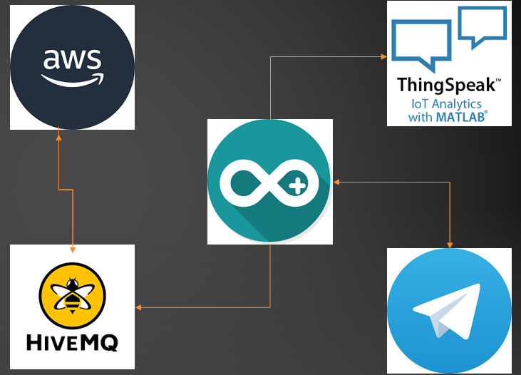

# AquaR.IoT ES SEC: A Secured, Serverless, Enhanced Aquarium with IoT ESP32 Board, AWS Services, and Telegram Integration

# Abstract:
AquaR.IoT ES SEC (Enhanced Serverless Secured) is a captivating project that showcases the fusion of IoT, serverless programming, and cloud integration to create a cutting-edge aquarium experience. This project, in his standard version (here's the repo: <url>https://github.com/brataccas99/acquar.iot</url>), features a fully functional aquarium populated with mesmerizing red fishes, equipped with an IoT ESP32 board, an array of sensors, motors, clocks, bridges, and other IoT components. By leveraging the power of the Zerynth platform, Python, and Zerynth Cloud, users can remotely interact with the aquarium, issuing commands such as feeding the fishes, oxygen regeneration, and water cleaning while effortlessly gathering valuable statistical data through Ubidots.

In the enhanced serverless version, AquaR.IoT ES embraces the advancements in technology by migrating from Zerynth to AWS services for serverless programming. Leveraging AWS Lambda and DynamoDB, the project achieves a more scalable, efficient, and streamlined architecture. Additionally, a Telegram bot replaces the previous Zerynth Cloud functionality, enabling users to effortlessly send commands to the aquarium via AWS Lambda's seamless integration with the popular messaging platform.
In this enhanced, serverless, secured version, AquaR.IoT ES SEC embraces the advancements in technology by migrating from Zerynth and localstack to Arduino and HiveMQ that uses AWS services for serverless programming. All the communications to the services are via an authority certificate to implement the requisite of secure connection, it has an additional buzzer in contrast with the first version and all of the lambda's that were used through the second version telegram bot are kept in this one to guaranteee the same user experience, what makes the difference here is that none of the functionalities are simulated, they are all implemented and working fine (fishes said!).

AquaR.IoT ES SEC represents a remarkable integration of cutting-edge technologies, enabling a fascinating and interactive aquarium experience that exemplifies the potential of IoT, serverless programming, and cloud integration.

## Architecture

## Prerequisite
- Dedicated hardware as ESP32, DS3231, 3 motors, 1 servo, 1 Buzzer
- Arduino IDE
- A telegram bot token and chat id
- ThingSpeak account, HiveMQ account

## How to run this project

- MANDATORY: create a telegram bot (from @botfather), retireve his chat id and bot token

## Easy way: One command setup

- clone this repo: <code>https://github.com/brataccas99/acquariot-es-sec</code>

- modify the wifi ssid, services credentials and bot charachteristics

- Load this code on a ESP32 (we used AZ-Delivery Node MCU V4 devkit-c)

- Open telegram and connect to your binded bot

- enjoy

# Further details

- the esp32 has some scheduled job in order to give fishes the best of their life and receive notifications when an automatic action is performed 
- all the fishes were so happy to live into these acquariums living their best life (for reference see videos of them in the standard project version)

# Future work

- more unit tests (and complete what's not)
- more features for fishes games
- dedicated mobile app with chatbot (replacing the telegram bot)
- introducing AI && ML services from aws iot to prevent infection and bacteria contained in the water
- more fishes!  
